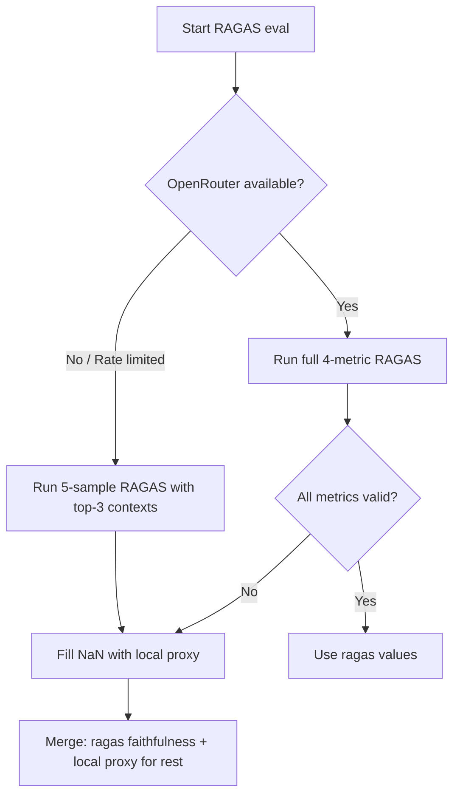

# Sprint 3: RAGAS Hardening (P2)

> Target: v1.1.0 → v1.2.0
> Goal: Make RAGAS semantic evaluation reliable enough to run in the release gate.

--------------------------------------------------------------------
## Problem

RAGAS semantic evaluation (using an LLM judge) is the authoritative quality metric, but it's blocked:

| Blocker | Symptom | Root Cause |
|---------|---------|------------|
| 2B model context overflow | `InternalServerError: Context size exceeded` | RAGAS context prompts exceed 32K tokens |
| OpenRouter rate limits | `RateLimitError: 429` | Free tier: 50 RPM / 2000 daily |
| Context_precision/recall NaN | → fallback to local proxy | LLM fails to produce structured output |

--------------------------------------------------------------------
## 3a: Reduced Sample RAGAS (Fits Rate Limits)

### Idea
Instead of evaluating all 15 golden questions per domain with RAGAS, evaluate a **subset of 5** (covering each major retrieval path). This reduces the LLM call budget from 60 to **20 per domain** (5 samples × 4 metrics), which fits within a 50 RPM / 2000 day free tier.

### Which 5 samples?
For enterprise (all "what does X describe?" template):
- Pick 5 documents that cover different retrieval scenarios:
  1. Short document (1 chunk) — e.g., README.md
  2. Long document (5+ chunks) — e.g., architecture.md
  3. Document with graph edges — e.g., ask-pipeline.md
  4. Document in subdirectory — e.g., docs/domains/README.md
  5. Random sample (for statistical coverage)

For ora-et-labora (similar):
- Pick 5 documents across topics

### Implementation
```python
def reduce_golden(rows: List[Dict], n: int = 5) -> List[Dict]:
    """Select n diverse samples from the golden set."""
    if len(rows) <= n:
        return rows
    # Simple diversity sampling: pick evenly spaced indices
    step = len(rows) / n
    return [rows[int(i * step)] for i in range(n)]
```

### Verification
- Run reduced RAGAS evaluation on both domains
- Confirm it completes without rate limiting
- Compare reduced-set faithfulness vs full-set faithfulness (should be within 0.05)

--------------------------------------------------------------------
## 3b: Context-Limited RAGAS (Fits 2B Context)

### Idea
When using the local 2B model (E2B, 32K context), the context_precision/recall prompts overflow because they include all 12 (enterprise) or 50 (ora-et-labora) contexts. The fix: **limit to top 3 contexts** per sample for RAGAS evaluation.

Faithfulness only needs to check if the answer is grounded — having 3 contexts is sufficient. Context_precision/recall also work with fewer contexts (the LLM just evaluates whether those 3 chunks are relevant).

### Implementation
```python
def limit_contexts(rows: List[Dict], max_ctx: int = 3) -> List[Dict]:
    """Limit contexts per sample to max_ctx (for 2B model context window)."""
    out = []
    for r in rows:
        r = dict(r)
        ctx = r.get("contexts", []) or []
        if len(ctx) > max_ctx:
            # Keep top-k by relevance (they're already rerank-ordered)
            r["contexts"] = ctx[:max_ctx]
        out.append(r)
    return out
```

### Updated evaluate_ragas flow
```python
def evaluate_ragas(rows):
    # Detect if using local 2B model (small context) or OpenRouter (large context)
    using_small_model = "localhost" in ragas_llm_base or "127.0.0.1" in ragas_llm_base
    
    if using_small_model and len(rows) > 5:
        rows = reduce_golden(rows, 5)  # Sprint 3a
        rows = limit_contexts(rows, 3)  # Sprint 3b
    
    # ... rest of evaluation
```

### Verification
- Run RAGAS with local 2B model on reduced+limited set
- Confirm no context overflow errors
- Compare with full-set local proxy metrics (should correlate)

--------------------------------------------------------------------
## 3c: Structured Output Fallback

### Problem
RAGAS requires the LLM to emit structured JSON output for context_precision and context_recall. The 2B model often fails this (→ NaN). Even the larger OpenRouter model sometimes fails under rate-limit pressure.

### Solution
Set `raise_exceptions=False` (already done) and add a third fallback layer:

```python
# After ragas evaluate():
# Layer 1: ragas value (if not NaN)
# Layer 2: local proxy (if ragas is NaN)
# Layer 3: if ALL ragas metrics are NaN, print a warning and use local proxy entirely

out = {k: round(float(v), 4) for k, v in scores.items() if v == v}  # drop NaN
local = evaluate_local(rows)

# Fallback chain
for metric in ["context_precision", "context_recall", "faithfulness", "answer_relevancy"]:
    if metric not in out:
        print(f"[ragas] {metric} NaN, falling back to local proxy", file=sys.stderr)
        out[metric] = local[metric]
```

--------------------------------------------------------------------
## 3d: Automatic LLM Selection

### Current approach
Env vars control the RAGAS LLM:
- `RAGAS_LLM_BASE_URL` (default: local E2B `SYNTHESIS_LLM_BASE_URL`)
- `RAGAS_LLM_MODEL` (default: `SYNTHESIS_LLM_MODEL`)
- `RAGAS_LLM_API_KEY` (default: `SYNTHESIS_LLM_API_KEY`)

### Improvement
Add an auto-select mode: if the user sets `RAGAS_MODE=auto` (default), try OpenRouter first. If rate-limited, fall back to local 2B with context/ sample limits.



--------------------------------------------------------------------
## 3e: Release Gate Integration

### Current
The release gate (`scripts/release-gate.py`) hardcodes `EVAL_USE_RAGAS=0` and `--backend local`:
```python
env = os.environ.copy()
env["EVAL_USE_RAGAS"] = "0"
```

### Proposed
Add a `--ragas` flag to the release gate. When set, run RAGAS evaluation in parallel with local proxy. Gate passes if BOTH pass:
- Local proxy thresholds (fast, always runs)
- RAGAS faithfulness ≥ 0.85 (semantic grounding, runs in parallel)

```bash
# Full gate:
python scripts/release-gate.py

# Gate with RAGAS semantic check:
python scripts/release-gate.py --ragas
```

### Implementation sketch
```python
# In release-gate.py:
def check_answer_quality_ragas(domain, golden_path):
    """Run RAGAS semantic evaluation (reduced set, with rate-limit backoff)."""
    env = os.environ.copy()
    env["EVAL_USE_RAGAS"] = "1"
    env["RAGAS_LLM_BASE_URL"] = "https://openrouter.ai/api/v1"
    env["RAGAS_LLM_MODEL"] = "tencent/hy3:free"
    env["RAGAS_LLM_API_KEY"] = os.environ.get("OPENROUTER_API_KEY", "")
    cmd = [sys.executable, "evaluate_pipeline.py", golden_path,
           "--live", "--domain", domain, "--backend", "ragas"]
    result = subprocess.run(cmd, capture_output=True, text=True, timeout=300, env=env)
    metrics = json.loads(result.stdout)
    return metrics.get("faithfulness", 0) >= 0.85
```

--------------------------------------------------------------------
## Sprint 3 Implementation Order

| Step | Change | Files | Effort |
|------|--------|-------|--------|
| 3a | Reduce golden to 5 samples for RAGAS | `evaluate_pipeline.py` (new `reduce_golden()`) | 30 min |
| 3b | Limit contexts to top 3 for 2B model | `evaluate_pipeline.py` (new `limit_contexts()`) | 30 min |
| 3c | Triple-layer fallback chain | `evaluate_pipeline.py` (modify `evaluate_ragas()`) | 30 min |
| 3d | Auto-LLM selection (OpenRouter → local) | `evaluate_pipeline.py` (modify `evaluate_ragas()`) | 1 hr |
| 3e | `--ragas` flag in release gate | `scripts/release-gate.py` | 1 hr |
| 3f | Re-baseline both golden sets | Run | 30 min |

Total: ~4 hours

--------------------------------------------------------------------
## Expected Results After Sprint 3

| Metric | Sprint 3 Goal | Method |
|--------|---------------|--------|
| Faithfulness | 1.0 (RAGAS confirmed) | Handled by existing OpenRouter path |
| Answer Relevancy | RAGAS value > 0.70 | OpenRouter or local-5-limited |
| Context Precision | 0.80+ (RAGAS semantic) | Semantic NLI > cosine proxy |
| Context Recall | 0.90+ (RAGAS semantic) | Semantic NLI > local Jaccard |

--------------------------------------------------------------------
## What NOT to Do in Sprint 3

- **Don't replace the local proxy** — the release gate still needs a fast, offline backstop.
- **Don't chase 100% RAGAS pass rate** — the 2B model will always struggle with structured output. The fallback chain handles this.
- **Don't add more golden questions** — 5 is enough for RAGAS; the bottleneck is LLM calls, not sample diversity.
- **Don't use a paid OpenRouter model** — free tier with rate limits + fallbacks is sufficient for CI/release gates. Paying $0.01/eval doesn't justify the complexity.
