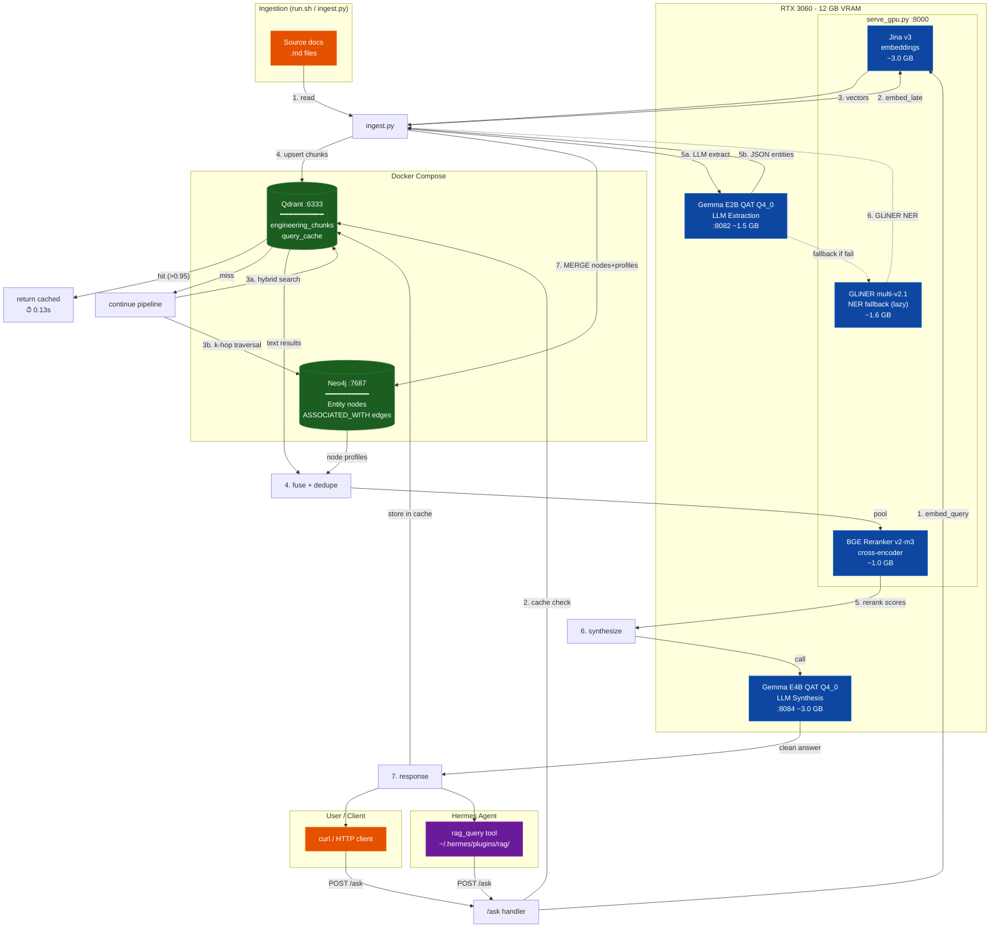

# GraphRAG v2.4.1 — Full Architecture

---

## ASCII Flow Diagram

```
                              ┌─────────────────────────────────────────────────────────┐
                              │                   RTX 3060 (12 GB VRAM)                  │
                              │                                                          │
                              │  ┌─────────────────────────┐  ┌──────────────────────┐  │
                              │  │   Gemma E2B QAT Q4_0     │  │  Gemma E4B QAT Q4_0  │  │
                              │  │   :8082 (systemd)         │  │  :8084 (systemd)     │  │
                              │  │   ┌─────────────────┐    │  │  ┌────────────────┐  │  │
                              │  │   │ LLM Extraction   │    │  │  │ LLM Synthesis  │  │  │
                              │  │   │ (JSON entities   │    │  │  │ (answer gen    │  │  │
                              │  │   │  + edges)        │    │  │  │  from context) │  │  │
                              │  │   └────────┬────────┘    │  │  └───────┬────────┘  │  │
                              │  │     ~1.5 GB              │  │    ~3.0 GB           │  │
                              │  └───────────┼──────────────┘  └─────────┼────────────┘  │
                              │              │                           │               │
                              │  ┌───────────┴───────────────────────────┴────────────┐  │
                              │  │            serve_gpu.py daemon :8000               │  │
                              │  │             (FastAPI, single worker)                │  │
                              │  │                                                     │  │
                              │  │  ┌──────────────────────────────────────────────┐  │  │
                              │  │  │          Resident Models (GPU, half())        │  │  │
                              │  │  │                                               │  │  │
                              │  │  │  ┌──────────────┐  ┌──────────────┐          │  │  │
                              │  │  │  │ Jina v3      │  │ BGE Reranker │          │  │  │
                              │  │  │  │ (1024-dim    │  │ v2-m3        │          │  │  │
                              │  │  │  │  embed)      │  │ (cross-enc)  │          │  │  │
                              │  │  │  │  ~3.0 GB     │  │  ~1.0 GB     │          │  │  │
                              │  │  │  └──────┬───────┘  └──────┬───────┘          │  │  │
                              │  │  │         │                  │                  │  │  │
                              │  │  │  ┌──────┴─────────────────────────────────┐  │  │  │
                              │  │  │  │ GLiNER (lazy)                          │  │  │  │
                              │  │  │  │ NER fallback for extraction           │  │  │  │
                              │  │  │  │ ~1.6 GB                                │  │  │  │
                              │  │  │  └────────────────────────────────────────┘  │  │  │
                              │  │  │                                               │  │  │
                              │  │  │  TOTAL AUX: ~5.6 GB (GLiNER not resident)    │  │  │
                              │  │  └──────────────────────────────────────────────┘  │  │
                              │  │                                                     │  │
                              │  │  Endpoints:                                         │  │
                              │  │  ┌────────────┐ ┌───────────┐ ┌──────────────┐    │  │
                              │  │  │ POST /ask  │ │POST/embed*│ │POST /rerank  │    │  │
                              │  │  │            │ │POST/rnk    │ │POST/extract  │    │  │
                              │  │  │ one-call   │ │embed_late │ │GET  /health  │    │  │
                              │  │  │ full RAG   │ │embed_query│ │              │    │  │
                              │  │  └─────┬──────┘ └───────────┘ └──────────────┘    │  │
                              │  └───────┼────────────────────────────────────────────┘  │
                              │          │                                                │
                              │  TOTAL GPU: ~10.6 GB / 12 GB                              │
                              └──────────┼────────────────────────────────────────────────┘
                                         │
                    ┌────────────────────┼────────────────────┐
                    │                    │                    │
              ┌─────┴─────┐        ┌─────┴─────┐        ┌─────┴─────┐
              │  Qdrant   │        │   Neo4j   │        │  Docker   │
              │  :6333     │        │  :7687    │        │  Compose  │
              │  (REST)    │        │  (Bolt)   │        │           │
              │            │        │           │        │           │
              │ Collections│        │ Graph DB  │        │           │
              │ ┌────────┐ │        │           │        │           │
              │ │engineer│ │        │ Entities  │        │           │
              │ │_chunks │ │        │ + edges   │        │           │
              │ │(hybrid)│ │        │ (MERGE)   │        │           │
              │ ├────────┤ │        │           │        │           │
              │ │query   │ │        │ ┌───────┐ │        │           │
              │ │_cache  │ │        │ │Entity │ │        │           │
              │ │(cosine)│ │        │ │ nodes │ │        │           │
              │ └────────┘ │        │ └───┬───┘ │        │           │
              │            │        │     │     │        │           │
              │ BinaryQuant│        │  ┌──┴───┐ │        │           │
              │ on-disk    │        │  │Edges │ │        │           │
              │            │        │  │ASSOC │ │        │           │
              │            │        │  │_WITH │ │        │           │
              │            │        │  └──────┘ │        │           │
              └────────────┘        └───────────┘        └───────────┘
```

---

## Data Flow: Ingest Path

```
                          INGEST PATH (run.sh ingest or ingest.py)

  Source docs (.md)
       │
       ▼
  ┌──────────────────────────────────────────────────────────────┐
  │  ingest.py                                                   │
  │                                                              │
  │  [1] delete_doc_qdrant(doc_id)   ← clean stale chunks       │
  │  [2] delete_doc_neo4j(doc_id)    ← clean stale nodes/edges   │
  │                                                              │
  │  [3] POST :8000/embed_late       ← per-sentence Jina embed   │
  │      → 43 chunks of 1024-dim vectors                         │
  │                                                              │
  │  [4] _sparse(chunk)              ← hash-based lexical index  │
  │      → hash(token) % 65536       ← consistent across all     │
  │                                                              │
  │  [5] Qdrant.upsert(              ← write to engineering_chunks│
  │        chunks_collection,        ← dense + sparse+ text      │
  │        points=[...])                                         │
  │                                                              │
  │  [6] LLM Extraction (primary):                               │
  │      POST :8082/v1/chat/completions                          │
  │      → E2B generates JSON {nodes, edges}        ✓ loaded     │
  │      │                                                       │
  │      └─── FALLBACK (if E2B fails): ──────┐                   │
  │          POST :8000/extract_graph         │                   │
  │          → GLiNER NER + co-occurrence     │ lazy-loaded       │
  │                                          │                   │
  │  [7] _build_profile(entity, chunks)      │                   │
  │      → 1-3 sentence context window       ▼                   │
  │                                          │                   │
  │  [8] Neo4j MERGE for each entity:                            │
  │      ┌─────────────────────────────────────────────┐         │
  │      │ MERGE (n:Entity {id: "bug-204"})             │         │
  │      │ SET n.name, n.type, n.profile, n.doc_id      │         │
  │      │ MERGE (n)-[:ASSOCIATED_WITH]->(m)            │         │
  │      └─────────────────────────────────────────────┘         │
  │                                                              │
  │  RESULT: doc ingested → vectors in Qdrant, graph in Neo4j    │
  └──────────────────────────────────────────────────────────────┘
```

---

## Data Flow: Query Path (GET /ask)

```
                          QUERY PATH (POST :8000/ask)

  User query: "who reported BUG-204 and what severity?"
       │
       ▼
  ┌──────────────────────────────────────────────────────────────┐
  │  serve_gpu.py  /ask handler                                   │
  │                                                              │
  │  [1] EMBED QUERY                                              │
  │      _jina.encode(query, task="retrieval.query")             │
  │      → 1024-dim vector (GPU, in-process)                     │
  │      ⏱ ~0.09s                                                │
  │                                                              │
  │  [2] SEMANTIC CACHE CHECK  (skip if synthesize=false)         │
  │      Qdrant query_cache → query_points with score_threshold  │
  │      > 0.95 cosine similarity?                                │
  │      │                                                       │
  │      ├─ YES → return cached answer  ⏱ ~0.13s, 0 E4B tokens  │
  │      │                                                       │
  │      └─ NO  → continue pipeline                              │
  │                                                              │
  │  [3] PARALLEL RETRIEVAL (threading)                           │
  │      ┌────────────────────┐    ┌──────────────────────┐      │
  │      │ Thread A: QDRANT   │    │ Thread B: NEO4J      │      │
  │      ╞════════════════════╡    ╞══════════════════════╡      │
  │      │ Search engineering │    │                      │      │
  │      │ _chunks collection │    │ [3a] Fetch entities  │      │
  │      │                    │    │ MATCH (n:Entity)     │      │
  │      │ Hybrid via RRF:    │    │ RETURN n             │      │
  │      │ • dense (ANN)      │    │ ⏱ ~0.01s             │      │
  │      │ • sparse (hash)    │    │                      │      │
  │      │   (same hash fn    │    │ [3b] Keyword-overlap │      │
  │      │    as ingest)      │    │ scoring              │      │
  │      │                    │    │ re.findall(r'\w+')   │      │
  │      │ ⏱ ~0.04s          │    │ → "bug","204" match  │      │
  │      │ → 10 text results  │    │   "bug-204" entity   │      │
  │      └────────┬───────────┘    │ ⏱ <0.01s             │      │
  │               │                │                      │      │
  │               │                │ [3c] 2-hop traversal │      │
  │               │                │ MATCH (e)-[*1..2]-(m)│      │
  │               │                │ → neighbor profiles   │      │
  │               │                │ ⏱ <0.01s             │      │
  │               │                │ → 22 text profiles   │      │
  │               └────────┬───────┘                      │      │
  │                        │                              │      │
  │                        ▼                              │      │
  │  [4] FUSE + DEDUPE                                        │      │
  │      pool = unique(q_res + g_res)                        │      │
  │      → ~27 unique text candidates                         │      │
  │                                                              │
  │  [5] RERANK (in-process, GPU)                                │
  │      _reranker.predict([(query, doc) for doc in pool])      │
  │      → BGE cross-encoder scores                             │
  │      → sorted, keep top 5                                   │
  │      ⏱ ~0.12s                                               │
  │                                                              │
  │  [6] SYNTHESIZE  (skip if synthesize=false)                  │
  │      POST :8084/v1/chat/completions (E4B)    ──────────┐    │
  │      → stream chunks:                                   │    │
  │        • reasoning_content → print(stdout) only         │    │
  │        • content → collect as clean answer              │    │
  │      → answer: "bob [1]. Severity: SEV-2 [1]"          │    │
  │      ⏱ ~6.35s                                          │    │
  │                                                         │    │
  │  [7] CACHE STORE (if synthesize=true)                   │    │
  │      Qdrant.upsert(                                     │    │
  │        query_cache,                                     │    │
  │        vector=query_vec,                                │    │
  │        payload={contexts, answer, path, scores}         │    │
  │      )                                                  │    │
  │                                                         │    │
  │  RESPONSE:                                              │    │
  │  {                                                      │    │
  │    "source": "llm",          "path": "hybrid",          │    │
  │    "qdrant_hits": 10,        "graph_hits": 22,          │    │
  │    "rerank_scores": [0.977, 0.358, ...],               │    │
  │    "n_contexts": 5,          "cache_hit": false,        │    │
  │    "contexts": [...],        "answer": "bob [1]..."     │    │
  │  }                                                      │    │
  └──────────────────────────────────────────────────────────────┘

  SUMMARY TIMING:
  ═══════════════════════════════════════════════════════════
   embed     0.09s  │████
   qdrant    0.04s  │██
   neo4j     0.01s  │█
   rerank    0.12s  │█████
   synth     6.35s  │███████████████████████████████████████  (96%)
  ──────────────────
   TOTAL     6.64s
  ═══════════════════════════════════════════════════════════
```

---

## Hermes Integration

```
  ┌──────────────────────────────────────┐
  │       Hermes Agent (CLI/Discord)      │
  │                                       │
  │  Plugin: ~/.hermes/plugins/rag/       │
  │  ┌────────────────────────────────┐   │
  │  │ plugin.py                      │   │
  │  │ ┌────────────────────────────┐ │   │
  │  │ │ def rag_query(query: str)  │ │   │
  │  │ │   POST /ask               │ │   │
  │  │ │   → parse answer+contexts │ │   │
  │  │ │   → return to agent       │ │   │
  │  │ └────────────────────────────┘ │   │
  │  │                                │   │
  │  │ RAG_DAEMON_URL                 │   │
  │  │ (default: 127.0.0.1:8000)     │   │
  │  └────────────────────────────────┘   │
  │                                       │
  └───────────────────┬───────────────────┘
                      │ HTTP POST /ask
                      ▼
          ┌───────────────────┐
          │  serve_gpu.py     │
          │  (RAG Daemon)     │
          └───────────────────┘
```

---

## Systemd Services

| Service | Port | Model | VRAM | Type | Start |
|---------|------|-------|------|------|-------|
| `gemma-4-e2b` | :8082 | Gemma E2B QAT Q4_0 | ~1.5 GB | forking | boot |
| `gemma-4-e4b` | :8084 | Gemma E4B QAT Q4_0 | ~3.0 GB | forking | boot |
| `orphit-9b` | :8081 | Ornith 9B Q4_K_M | ~5.5 GB | forking | manual |
| `gemma-12b` | :8083 | Gemma 4 12B (legacy) | ~5 GB | — | manual |

> Ornith and Gemma 12B are NOT active during normal RAG operation (would exceed VRAM).
> E2B + E4B + daemon aux models = ~10.7 GB. The sequential VRAM strategy from v1
> (swap Ornith↔Gemma per-phase) is no longer needed in the all-GPU v2 architecture.

---

## Port Map

```
  Port      Service              Protocol
  ──────────────────────────────────────────
  :8000     serve_gpu.py         HTTP (FastAPI)
  :8082     Gemma E2B (extract)  HTTP (OpenAI compat)
  :8084     Gemma E4B (synth)    HTTP (OpenAI compat)
  :6333     Qdrant               REST + gRPC
  :7687     Neo4j                Bolt
  :7474     Neo4j                HTTP (browser)

  Inactive during RAG:
  :8081     Ornith 9B (legacy)   HTTP
  :8083     Gemma 12B (legacy)   HTTP
```

---

## Mermaid Diagram



---

## Version History

| Version | Date | Summary |
|---------|------|---------|
| v1.0 | Jul 8 | CPU aux models, sequential VRAM, Gemma 12B only |
| v2.0 | Jul 9 | GPU aux models, E2B+E4B, /ask API, Hermes plugin |
| v2.1.0 | Jul 10 | Hash sparse, Neo4j profiles, delete-before-reingest, tokenizer fix |
| v2.2.0 | Jul 10 | Semantic cache, route labels, clean E4B output |
| v2.2.1 | Jul 10 | Remove MiniLM — 50% accuracy, parallel retrieval is better |
| v2.3.0 | Jul 10 | Vector-driven entity resolution, CANON_MAP removed |
| v2.4.0 | Jul 10 | Fully modular — model-agnostic config, behavior flags |
| v2.4.1 | Jul 10 | Dual-architecture reranking, CPU pool cap, fp16 fix |
