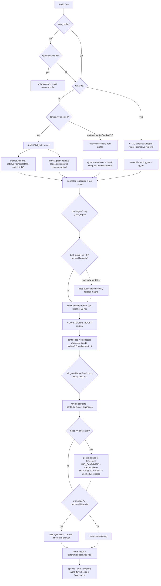

# /ask pipeline (full flow)

End-to-end request path for `POST /ask`. One HTTP call: cache → route →
retrieve → fuse/rerank → (optional) differential persistence → synthesize.

## Mermaid

## Stage notes

| Stage | What | Key code |
|-------|------|----------|
| Cache | Qdrant `query_cache` lookup by `hash(query)` | `ask()` top |
| Route | `domain=snomed` → hybrid (graph+prose); else collections from profile | `ask()` branch |
| Retrieve | SNOMED term-match + clinical_prose dense; or Qdrant+Neo4j parallel | `get_retriever` |
| Fuse | normalise records, tag `_signal`, compute `_dual_signal` | fusion block |
| Rerank | cross-encoder bge-reranker-v2-m3, +0.15 dual boost | `_reranker.predict` |
| Confidence | raw (de-boosted) score → high/medium/low | `_confidence()` |
| Filter | `min_confidence` floor (keep ≥1) | fusion block |
| Persist | Neo4j Differential/DxCandidate (mode=differential only) | `_persist_differential` |
| Synthesize | E2B (Gemma) → answer; forced on for differential | `rag.synthesize` |

## Tuning knobs (config.py, no code edits)

- `CONFIDENCE_HIGH_THRESHOLD = 0.50`
- `CONFIDENCE_MEDIUM_THRESHOLD = 0.15`
- `DUAL_SIGNAL_BOOST = 0.15`
- live via `GET /config`

## Query params

- `domain` — snomed | engineering | medical | clinical_prose | ...
- `mode: "differential"` — ranked Dx + forced synthesis + Neo4j persist
- `dual_signal_only: true` — keep only dual-confirmed
- `min_confidence: "low"|"medium"|"high"` — floor the differential
- `synthesize: false` — return contexts only
- `skip_cache: true` — bypass/avoid cache
- `top_k` — candidates returned (default 5)
