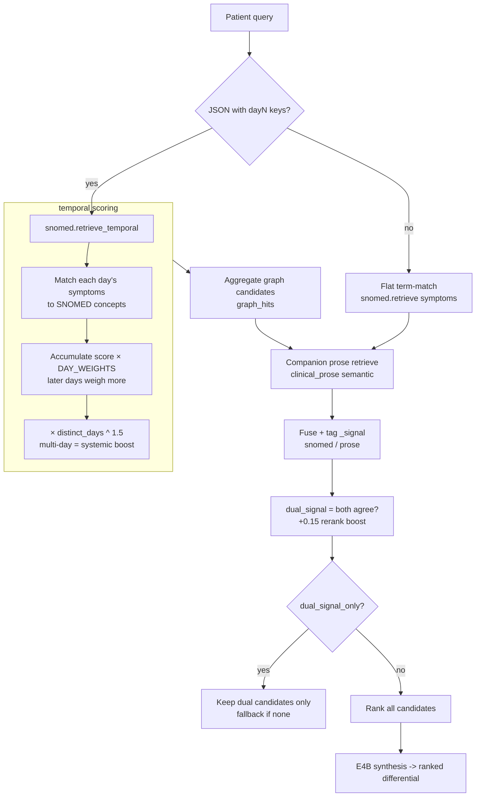

# Temporal (day-by-day) diagnosis flow

## What it's for

The temporal branch separates **acute self-limited** presentations (one window)
from **chronic / progressive** ones (span days or weeks). It is MOST useful for
the systemic/progressive end (HIV/AIDS, TB, lymphoma, SLE) and LEAST useful for
acute "light" disease (measles, rubella, dengue, influenza) — those work fine
as a single flat `{"day1":[...]}` term-match.

> Clinical caveat: SNOMED CT has NO onset/duration/fever-curve data. The
> `dayN:` labels are a heuristic WE bolted on, not clinically derived. No
> retriever here diagnoses AIDS from symptoms — real diagnosis needs risk
> factors + HIV serology. The branch only *nudges* systemic Dx up when you
> hand it a pre-structured timeline. In real notes symptoms are free-text
> ("3 weeks of fever, lost 10kg"), not clean JSON. This is a demo scaffold,
> not an EHR parser.

## Flow



## How the scoring actually works

```python
presentation = {
  "day1": ["fever", "fatigue"],
  "day2": ["rash", "lymphadenopathy"],
  "day3": ["weight loss", "oral candidiasis"],
}

# each day matched independently to SnomedDescription.term (IDF-weighted)
# day_weight: later days weigh more  -> recent specific sx push harder
# final_score *= (distinct_days) ** 1.5  -> chronic/multi-system Dx amplified
```

For the AIDS example above:
- day1 fever/fatigue are common (low IDF, but early)
- day3 oral candidiasis + weight loss are rare + discriminative (high IDF) AND
  late → they dominate, and the multi-day coverage boost lifts systemic Dx
  (HIV/AIDS, TB, lymphoma) above the acute rash-only ones.

## API

```bash
# temporal presentation
curl -X POST localhost:8000/ask -H 'Content-Type: application/json' -d '{
  "query": "{\"day1\":[\"fever\",\"fatigue\"],\"day2\":[\"rash\"],\"day3\":[\"weight loss\",\"oral candidiasis\"]}",
  "domain": "snomed", "synthesize": true
}'

# flat (acute) presentation — equivalent to day1-only
curl -X POST localhost:8000/ask -H 'Content-Type: application/json' -d '{
  "query": "fever and rash and cough", "domain": "snomed"
}'

# keep ONLY candidates confirmed by both SNOMED + prose
curl -X POST localhost:8000/ask -H 'Content-Type: application/json' -d '{
  "query": "fever and rash", "domain": "snomed", "dual_signal_only": true
}'

# differential mode: ranked Dx w/ confidence, dual-signal preference, synthesis on
curl -X POST localhost:8000/ask -H 'Content-Type: application/json' -d '{
  "query": "fever and rash", "domain": "snomed", "mode": "differential"
}'
# -> result.diagnoses = [{rank, candidate, confidence: high|medium|low,
#                         dual_signal, rerank_score}, ...]
#    confidence bands (on RAW cross-encoder score, de-boosted):
#      raw >= 0.50 -> high;  >= 0.15 -> medium;  else low
#      (calibrated on bge-reranker-v2-m3, see docs/rerank-calibration.md)
#    dual_signal is a SEPARATE corroboration flag, not part of confidence.
#    NOTE: confidence = strength of evidence (keyword+semantic overlap), NOT
#    clinical probability of the disease.

# min_confidence floor: drop candidates below this from `diagnoses`
curl -X POST localhost:8000/ask -H 'Content-Type: application/json' -d '{
  "query": "fever and rash", "domain": "snomed", "mode": "differential",
  "min_confidence": "medium"
}'

# live calibration knobs (no source reading needed)
curl localhost:8000/config

# persisted differential audit (Neo4j)
curl localhost:8000/differentials                 # list recent
curl "localhost:8000/differentials?query=<exact-query>"   # one differential + candidates
```

## Audit persistence (Neo4j)

Every `mode: "differential"` call persists a structured differential to Neo4j
(never fatal — failures are swallowed):

```
(:Differential {id, query, mode, min_confidence, path, created})
   -[:HAS_CANDIDATE]-> (:DxCandidate {rank, candidate, confidence, dual_signal, rerank_score})
        -[:MATCHES_CONCEPT]-> (:SnomedDescription)   # best-effort name match
```

The `Differential` node is keyed by `hash(query, mode, min_confidence)` so
re-runs are idempotent (old candidates are cleared and re-added). `DxCandidate`
links to `SnomedDescription` when the candidate name `CONTAINS` a SNOMED term,
enabling later graph review of which terminology entries back each diagnosis.
Retrieve via `GET /differentials` (optionally `?query=`).

Note: SNOMED concept *names* live on `SnomedDescription` (not `SnomedConcept`),
so the enrichment matches there. Diseases whose prose/article title doesn't
appear verbatim in SNOMED descriptions (e.g. "oral candidiasis" as phrased)
simply won't get a `MATCHES_CONCEPT` edge — that's expected, not an error.

## Try-it-out (single command, all paths)

```bash
for q in \
  'fever and rash and cough' \
  '{"day1":["fever","fatigue"],"day2":["rash"],"day3":["weight loss","oral candidiasis"]}' \
  'fever and rash' ; do
  echo "=== $q ==="
  curl -s -X POST localhost:8000/ask -H 'Content-Type: application/json' \
    -d "{\"query\":\"$q\",\"domain\":\"snomed\",\"synthesize\":false}" \
    | python3 -c "import sys,json;d=json.load(sys.stdin);print('path',d['path'],'graph',d['graph_hits'],'qdrant',d['qdrant_hits'])"
done
```
