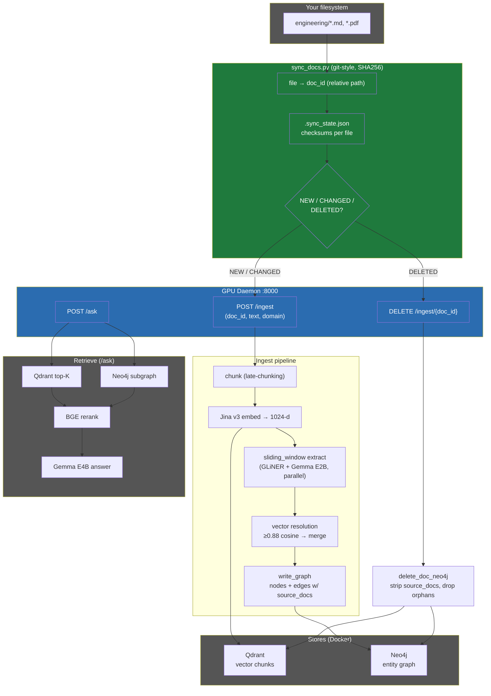

# LinkedIn post — GraphRAG: from 22 entities to a consistent, self-syncing knowledge graph

(Post text below. Mermaid diagram can be rendered on LinkedIn with a mermaid
live-editor screenshot, or pasted into any markdown-capable platform.)

---

## Post copy

We open-sourced a fix that bothered me for a while: our GraphRAG was quietly
dropping most of the knowledge in a document.

A 16-page paper ingested as just **22 entities** — because a greedy JSON parse
bug made the extractor silently fall back to a coarse NER model, and the
default single-pass LLM under-extracted. The fix was two parts:

1. A brace-aware JSON extractor so the LLM path never silently fails.
2. Parallel **sliding-window** extraction (per-window GLiNER + LLM, concurrent)
   as the default — going from 22 to **130+ real entities** with typed relations
   (USES / OUTPERFORMS / CITES / EVALUATES…), ~1.5× faster.

But the bigger question was durability: *does editing or deleting a source doc
actually update the graph?* It didn't, cleanly. So we added:

- `source_docs` attribution on **both nodes and relationships** — so a relation
  is removed exactly when the last document asserting it is gone (no stale
  edges lingering through shared entities).
- `sync_docs.py` — a git-style sync client that maps files → stable doc_ids and
  keeps Neo4j + Qdrant consistent with your filesystem via SHA256 change
  detection. Create / edit / delete a file → the graph follows. --watch mode
  does it in real time.

The result: ingest a real engineering doc, ask questions, edit the doc, sync —
  the graph stays exactly consistent. No manual graph surgery.

Local-only, model-agnostic (swap Jina/E2B/E4B by changing config), Docker for
Neo4j + Qdrant. MIT-style, link in comments.

#GraphRAG #RAG #KnowledgeGraph #Neo4j #Qdrant #LocalLLM #opensource

---

## Mermaid diagram (architecture + sync flow)

---

## How to use the diagram on LinkedIn
LinkedIn doesn't render mermaid natively. Options:
1. Paste the mermaid code into https://mermaid.live, export as SVG/PNG, attach the image.
2. Or just post the text + attach a screenshot of the diagram.
3. The same mermaid block renders natively on GitHub (this repo's README/QUICKSTART).
